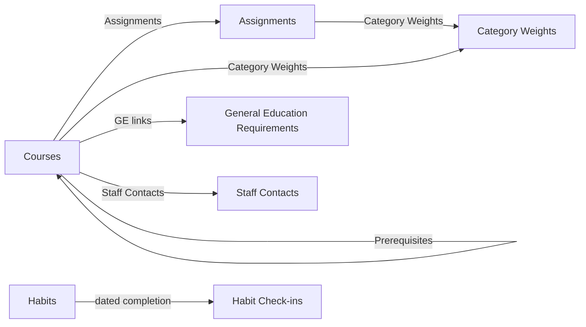

# Airtable Physical Schema

This document records the live Airtable implementation used by Aydin. It is
the source of truth for table IDs, field IDs, Airtable field types, links, and
the current application contract.

Conceptual entities, long-term relationships, and build dependencies belong in
[`architecture.md`](architecture.md). This file should describe what exists in
Airtable now, not duplicate the future domain model.

## Base

| Property | Value |
| --- | --- |
| Current name | `Assignment Tracker` |
| Base ID | `appVy9thv2l5e9JKv` |
| Metadata inspected | 2026-06-29 |
| Live tables | 8 |

The architecture roadmap proposes renaming this base to ARES. That rename has
not happened yet.

## Application Contract

The current app exposes these Airtable-backed operations:

```text
GET   /api/assignments
GET   /api/courses
PATCH /api/assignments/:id
GET   /api/inbox
POST  /api/inbox
DELETE /api/inbox/:id
GET   /api/habits?weekStart=YYYY-MM-DD
POST  /api/habits
PATCH /api/habits/:id
PUT   /api/habits/:id/check-ins/:date
DELETE /api/habits/:id/check-ins/:date
```

The PATCH operation accepts a strict partial update for Assignment Name,
Courses, Due Date, Points Possible, Week, or Completed. Completion maps checked
to domain status `submitted` and unchecked to `not_started`.

Editor requests send a Pacific local `dueDate` with an optional `dueTime`.
Date-only deadlines are stored at 11:59 PM in `America/Los_Angeles`; the app
treats that time as a date-only display convention. Assignment Type remains
read-only until its select taxonomy is expanded.

Field names used by the adapter are centralized in
`src/airtable/schema.ts`. Airtable credentials remain server-side.

## Relationship Map



## Courses

Table ID: `tbl3nkjD0LefcY3t9`

### Application-Facing Fields

| Field | Field ID | Airtable type | App use |
| --- | --- | --- | --- |
| Course Name | `fldX5u5DvwA3p8H3c` | `singleLineText` | `Course.name` |
| Credit Hours | `fld7mBgD6pwhJHsSA` | `number` | `Course.creditHours` |
| Status | `fldQlvxzyWrrM5EnB` | `singleSelect` | `Course.status` |
| Quarter Taken | `fld1N3BYeCANzlvTC` | `singleSelect` | `Course.quarterTaken` |
| Major Requirements | `fldaEARDf5on1ZzK7` | `multipleSelects` | `Course.majorRequirements` |
| GE Requirements Used | `fldDlz8Hl8sn0hLES` | `multipleRecordLinks` | Links General Education Requirements; resolved for display |
| Grade | `fldng2A0mQPGrGQ6F` | `singleSelect` | `Course.grade` |
| Category Weights | `fldRAc1CApuVKPajC` | `multipleRecordLinks` | Links `tblXC0Vug7xyPFZqW` |

### Other Live Fields

| Field | Field ID | Airtable type | Relationship/role |
| --- | --- | --- | --- |
| Available to take now? | `fldLbzythsrjSmqkP` | `formula` | Planning calculation |
| Scheduled? | `fldg21Ia7RAgN5qHv` | `checkbox` | Planning state |
| Prerequisites | `fldk9llXkG1vVTAc9` | `multipleRecordLinks` | Self-link to Courses |
| From field: Prerequisites | `fldcjGgohq0b1kKuq` | `multipleRecordLinks` | Reciprocal self-link |
| Has Prerequisites? | `fldOydroQ2ZcZD2nr` | `formula` | Prerequisite calculation |
| Prerequisites Satisfied? | `fldbKAqE2y35YDvRf` | `formula` | Prerequisite calculation |
| Tentative Prerequisites Satisfied? | `fldUcaNJhDCezTnit` | `formula` | Planning calculation |
| Is Prerequisite | `fldaaqD5IjBWC9QCf` | `formula` | Prerequisite calculation |
| Professor | `fldCB3mnZtG7iAt4I` | `singleLineText` | Course metadata |
| Class Location | `fld2WYIRNWo1R8ANf` | `singleLineText` | Course metadata |
| Class Time | `fldCoMazyRy1J6AUg` | `singleLineText` | Course metadata |
| Discussion Location | `fldqfdK3DnUBXBS6v` | `singleLineText` | Course metadata |
| Discussion Time | `fldsFyakrxkqaqrOB` | `singleLineText` | Course metadata |
| Office Hours | `fldJOYnE4NnFY0JEd` | `multilineText` | Course metadata |
| Office Hours Locations | `fldNyDga1N0gZ43iy` | `singleLineText` | Course metadata |
| TA Office Hours Time | `fldyDJN3bQ1lT3Xt2` | `singleLineText` | Course metadata |
| TA Office Hours Locatoin | `fldrwB7R0Qe8Q8Bwd` | `singleLineText` | Course metadata; live name contains typo |
| Assignments | `fldJ53OmOXhD52DcL` | `multipleRecordLinks` | Links `tbllXlXa7oKsoFMae` |
| Textbook Link | `fldBPUoI37tJ2rygx` | `url` | Course resource |
| Points Earned Roll Up | `fldyZGfae9DzEs3ph` | `rollup` | Grade calculation |
| Total Points Rollup | `fldsNVmidfqo4BsTk` | `rollup` | Grade calculation |
| Grade By Points: | `fldmNIP5WWlkYAbH5` | `formula` | Grade calculation |
| Points Earned Roll Up copy | `fldqzwyjsPVdEAVoe` | `rollup` | Duplicate calculation candidate |
| Total Points Rollup copy | `fldW8nXvj8nsNTJhz` | `rollup` | Duplicate calculation candidate |
| Grade By Points: copy | `fld8wfSDpz7mdyUh2` | `formula` | Duplicate calculation candidate |
| Class Sessions | `fld0hhObLRTHyeoxg` | `singleLineText` | Legacy placeholder; not a linked table |
| Staff Contacts | `fldBRvsvl5JyxqPRw` | `multipleRecordLinks` | Links `tblcB7zTektBmiE0a` |
| Syllabus | `fldwatKuN19hFgW8x` | `multipleAttachments` | Course document |
| AI Insights | `fldqS0k27YwppC2sD` | `aiText` | Airtable AI output; not required by app |
| GE Requirements Satisfied | `fldKj17uGHqEXw3yu` | `multipleRecordLinks` | Links General Education Requirements |
| GPA Value | `fldCrtO8dPXxBCNIE` | `formula` | GPA calculation |
| Status (from Prerequisites) | `fldrvgYsmZpTqnx2q` | `multipleLookupValues` | Prerequisite lookup |

## General Education Requirements

Table ID: `tbl3Beqraxljn1aDm`

| Field | Field ID | Airtable type | Relationship/role |
| --- | --- | --- | --- |
| Category | `fldcaSRABMoms67bR` | `singleLineText` | Display label used by app |
| GE Type | `fldGujzhRm0p4bt1g` | `multipleSelects` | Requirement classification |
| Required Units | `fldUHyUtUR2Tnww1s` | `number` | Requirement target |
| GE Requirement USED | `flda6r0nnaG431y9b` | `multipleRecordLinks` | Links Courses |
| GE Requirement Satisfied | `fldhwf0bbuPsbU9eX` | `multipleRecordLinks` | Links Courses |
| Satisfied Units | `fldg525CjsmfUcsrG` | `rollup` | Completed-unit calculation |
| Remaining Units | `fldqUwIDXR3yLqEX0` | `formula` | Completed-unit calculation |
| Completed? | `fldDtZ2XzUdDM9LNo` | `formula` | Completion calculation |
| Tentative Satisfied Units | `fldIdVqTKnbSixzEW` | `rollup` | Planned-unit calculation |
| Tentative Remaining Units | `fld3ukgpQXDDTjwLq` | `formula` | Planned-unit calculation |
| Tentative Completed? | `fldwg4fqoraJHiMmY` | `formula` | Planned completion calculation |

## Assignments

Table ID: `tbllXlXa7oKsoFMae`

| Field | Field ID | Airtable type | Relationship/role |
| --- | --- | --- | --- |
| Assignment Name | `fldU0xvLg3grCmonN` | `singleLineText` | `Assignment.title` |
| Courses | `fldg8IIB1H8zwrSDH` | `multipleRecordLinks` | Links Courses; first link maps to `courseId` |
| Due Date | `fldEisJqSaUIIDWy8` | `dateTime` | `Assignment.dueAt` |
| Points Earned | `fld4rCP4y8j3ulO0Y` | `number` | `Assignment.pointsEarned` |
| Points Possible | `fldAWln49fynQWzFv` | `number` | `Assignment.pointsPossible` |
| Completed | `fldA1MTcA1wh0GLA4` | `checkbox` | Completion write |
| Category Weights | `fld33ksNpJYirqrfm` | `multipleRecordLinks` | Links `tblXC0Vug7xyPFZqW` |
| General Assignment Type | `fldAZvY3fCDuMp8gZ` | `singleSelect` | Maps to assignment category/type |
| Week | `fldk4t3tyOGLZ1ncx` | `singleSelect` | `Assignment.weekLabel` |
| Status (from Courses) | `fldzSwnKgLRb4Kbd1` | `multipleLookupValues` | Course-status lookup |
| Philosophy Problem Set | `fldUbeZvW1BkgKort` | `singleSelect` | Course-specific legacy field |
| Screenshot | `fldeJUkqebFYf436h` | `multipleAttachments` | Assignment evidence |
| Daily Plans | `fldGXp3Gr3UMD4byK` | `singleLineText` | Legacy placeholder; not a linked table |

## Inbox Items

Table ID: `tblpTfEK98iyHCaEb`

| Field | Field ID | Airtable type | Application role |
| --- | --- | --- | --- |
| Text | `fldXAwX2jCPSsc5mx` | `multilineText` | Required capture content |
| Created At | `fldGB45UhXXCHgwv3` | `dateTime` | Set automatically by the server |
| Processed | `fld6uRZAHwr5Vj3Ni` | `checkbox` | Always false until Inbox Review exists |

The current Intake screen creates captures only. GET and DELETE remain in the
API contract for a future review workflow, but Intake does not list, process,
or delete records.

## Habits

Table ID: `tblnPymbsaGbAtuum`

| Field | Field ID | Airtable type | Application role |
| --- | --- | --- | --- |
| Name | `fldH3LJ0SZ10an1Bx` | `singleLineText` | Required habit name |
| Target Days per Week | `fldqp5e6dK3fI0Dec` | `number` | Integer cadence from 1 through 7 |
| Status | `fldvQy9duk70Ya72S` | `singleSelect` | Active or Archived |
| Created At | `fldlkupf7xJ1aGF4Y` | `dateTime` | Server-set creation timestamp |

## Habit Check-ins

Table ID: `tblYMLiIEVUkQZmre`

| Field | Field ID | Airtable type | Application role |
| --- | --- | --- | --- |
| Key | `fldwKUd43qyAI3pMA` | `singleLineText` | Deterministic `habitId:YYYY-MM-DD` key |
| Habit | `fldGv76U3A8srROqs` | `multipleRecordLinks` | Links `tblnPymbsaGbAtuum` |
| Date | `fldTgiR19mBkjO2Qd` | `date` | Local completion date |
| Created At | `fldYkG614nyOBbXLB` | `dateTime` | Server-set creation timestamp |

The application treats Habit as a single conceptual link and prevents
duplicate habit/date check-ins. Deleting a habit in the interface archives its
definition and preserves check-ins.

## Category Weights

Table ID: `tblXC0Vug7xyPFZqW`

| Field | Field ID | Airtable type | Relationship/role |
| --- | --- | --- | --- |
| Category Weight Name | `fldFEB3hCPYfyr2gO` | `singleLineText` | `GradeCategory.name` |
| Courses | `fldlBGVyXIkQe2Vqy` | `multipleRecordLinks` | Links Courses; intended `GradeCategory.courseId` |
| Weight (%) | `fldgGJJJ21BKz8UvO` | `number` | `GradeCategory.weightPercent` |
| Assignments | `fldHqh72rPBkcq9JK` | `multipleRecordLinks` | Links Assignments |
| Points Earned Roll Up | `fldt6MAlctKPHkUnj` | `rollup` | Grade calculation |
| Total Points Roll Up | `flddbYyA6YnWVe845` | `rollup` | Grade calculation |
| Percent Per Category | `fldzt8fwE6o4RmN5C` | `formula` | Grade calculation |
| Num Assignments Completed | `fldA4rajqJPW7DYKJ` | `rollup` | Progress calculation |
| Total Assignments | `fldJ1hewqhQ3ivmor` | `rollup` | Progress calculation |
| Percent Completed | `fldqooqv7sjzENF1l` | `formula` | Progress calculation |
| Percent * Category Weight | `fldrbGtgBFqRb2B8r` | `formula` | Weighted-grade calculation |
| Max Current Grade | `fldRmC3MuOSI2zdI2` | `formula` | Weighted-grade calculation |
| Calculation | `fldKLOUv6A2o4LfOW` | `formula` | Grade calculation |

## Staff Contacts

Table ID: `tblcB7zTektBmiE0a`

This table is live but is not read by the current application.

| Field | Field ID | Airtable type | Relationship/role |
| --- | --- | --- | --- |
| Name | `fldnrCMRMSKjhtLup` | `singleLineText` | Contact name |
| Course | `fldET7kXEZhw8KqjN` | `multipleRecordLinks` | Links Courses |
| Role | `fldlxiyd4A5JT9t0V` | `singleSelect` | Professor, TA, or other role |
| Email | `fldGFrLnXnHcpXmzi` | `email` | Contact email |
| Office Hours | `flddl6PVsMwPttAJB` | `singleLineText` | Availability |
| Location | `fldsNZArHRBn2Ut8h` | `singleLineText` | Office/meeting location |
| Notes | `fldg9YqtcD2fvtMVC` | `multilineText` | Contact notes |

The architecture proposes broadening this concept into People when Career Hub
requires recruiters, mentors, professors, and other contacts. No migration has
been performed.

## Known Drift and Cleanup Candidates

### App Contract Drift

`src/airtable/schema.ts` currently declares the Category Weights course-link
field as `Subject`. The live field is:

```text
Courses (fldlBGVyXIkQe2Vqy, multipleRecordLinks -> tbl3nkjD0LefcY3t9)
```

Until the adapter is corrected, `GradeCategory.courseId` may not resolve and
course grade-policy enrichment may be incomplete.

### Live Schema Cleanup Candidates

These require review before any destructive change:

- Three Courses grade-calculation fields have `copy` duplicates.
- `TA Office Hours Locatoin` contains a typo.
- `Class Sessions` and Assignments `Daily Plans` are plain text placeholders,
  not relational tables.
- `Philosophy Problem Set` is course-specific data in the universal
  Assignments table.
- Airtable `AI Insights` exists but is not required by the current app.

Cleanup candidates are observations, not approved migrations.

## Planned Schema Migrations

The logical definitions and dependencies for future entities live in
[`architecture.md`](architecture.md). The implementation order is tracked in
[`../todo.md`](../todo.md).

Implemented after the original academic schema:

- Inbox Items and five-second capture.
- Habits and standalone dated Habit Check-ins.

The remaining approved schema-planning sequence is:

1. Back up the base and rename it to ARES.
2. Establish common immutable ID, lifecycle, timestamp, and archive fields.
3. Add Areas and Projects.
4. Add Work Items.
5. Add Activities and Sessions, then optionally link existing Habits.
6. Add Organizations, minimal People, and Career Opportunities.
7. Decide whether a Habit Check-in should optionally link or create a Session
   after the Activity and Session workflows exist.

Phase 5 may add a Portfolio Case Studies table after Experiences, Bullets, and
Artifacts exist. Portfolio and Resume Versions do not receive tables: Portfolio
is a read model, and each generated resume is stored as an immutable Artifact
output with source provenance.

Future tables should be added only when their corresponding application
workflow is ready to ship. This document must be updated from live metadata
after each migration.

## Environment

```text
AIRTABLE_API_KEY=
AIRTABLE_BASE_ID=
```

`AIRTABLE_BASE_ID` is optional because the current base ID is the application
default. The token requires record access for normal operation and
`schema.bases:read` for live schema verification.
