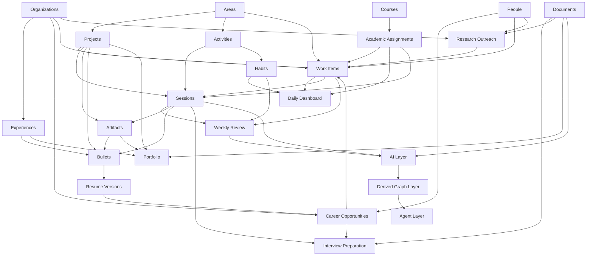

# Personal Operating System Architecture

## Purpose

Aydin is a Personal Operating System for reducing cognitive load, organizing
work, capturing evidence, and reusing information across school, career,
research, health, relationships, and creative practice.

The system must be useful without AI. AI may summarize, rank, draft, or detect
patterns later, but structured user-owned data and complete manual workflows
remain the source of truth.

## Architecture Principles

1. Capture information once and link it wherever it is needed.
2. Keep domain records explicit instead of creating a universal object table.
3. Build write models around real workflows and compose dashboards as read models.
4. Add one useful workflow at a time; do not expose unfinished navigation.
5. Store evidence before building analytics.
6. Archive records instead of deleting history.
7. Keep domain types independent from Airtable so storage can change later.
8. Add AI only after the corresponding manual workflow is reliable.
9. The system should never require planning. It should support planning when
   complexity justifies it.

## Storage Strategy

The current Airtable base is the operational database through the Execution
and Career phases. It should be renamed from `Assignment Tracker` to reflect
the broader Personal OS and extended incrementally rather than replaced in a
big-bang migration.

Airtable record IDs remain adapter identifiers. New Phase 2 records also
receive an immutable app-generated `id` so future storage migrations do not
change domain identity.

Every mutable table should use these common fields where they are meaningful:

| Field | Purpose |
| --- | --- |
| `id` | Immutable app-generated identifier |
| `status` | Explicit lifecycle state |
| `createdAt` | Creation timestamp |
| `updatedAt` | Last meaningful modification timestamp |
| `completedAt` | Completion timestamp for actionable records |
| `archivedAt` | Soft-deletion timestamp |

Existing academic records can continue using Airtable IDs until a migration is
justified. No current field or table is renamed as part of this documentation
phase.

## Domain Layers

The model distinguishes domain entities such as Courses, Academic Assignments,
Projects, Organizations, People, and Career Opportunities from the Work Item
planning entity. A Work Item is the smallest meaningful unit of action in a
plan; it may link to domain entities without becoming one of them.

### Structure

#### Area

A permanent part of life.

| Field | Requirement |
| --- | --- |
| `name` | Required and unique among active Areas |
| `description` | Optional |
| `status` | `active` or `archived` |

An Area has many Projects and Activities. Each Project and Activity has one
primary Area.

#### Project

A temporary initiative with a defined outcome.

| Field | Requirement |
| --- | --- |
| `areaId` | Required |
| `title` | Required |
| `desiredOutcome` | Required |
| `status` | `planned`, `active`, `paused`, `completed`, or `archived` |
| `startedAt`, `dueAt`, `completedAt` | Optional |
| `notes` | Optional |
| `experienceId`, `courseId` | Optional domain context |

A Project may have many Work Items, Sessions, Artifacts, Documents, and
Bullets.

#### Course and Academic Assignment

Courses and Academic Assignments are domain entities. An Academic Assignment
is a specific academic artifact created by the structure of a Course, such as
Homework 4, a midterm, a lab report, or a final project. It belongs to one
Course and may carry grading weight, points, assigned and due dates, Canvas or
submission information, and academic completion state.

An Academic Assignment does not require a Work Item. Work Items are created
only when additional planning provides value. For example, a final project may
be decomposed into Work Items for its literature review, prototype, report,
and presentation. Academic Assignment and Work Item completion remain
independent.

### Capture and Action

#### Inbox Item

A temporary low-friction capture record used when the final entity type is not
known yet.

| Field | Requirement |
| --- | --- |
| `content` | Required |
| `source` | `manual`, `email`, `web`, `mobile`, or `integration` |
| `capturedAt` | Required |
| `status` | `unprocessed`, `triaged`, or `discarded` |
| Converted links | Optional links to the resulting Work Item, Project, Document, or other record |

Inbox Items are not permanent knowledge. Triage either converts, links, or
discards them.

#### Work Item

Any actionable unit of work. Its source is irrelevant: it may be assigned by
another person, created by the user, or arise from any life domain.

| Field | Requirement |
| --- | --- |
| `title` | Required |
| `status` | `inbox`, `next`, `scheduled`, `waiting`, `completed`, `canceled`, or `archived` |
| `areaId` | Optional broad context |
| `projectId` | Optional |
| `academicAssignmentId` | Optional |
| `organizationId`, `personId` | Optional when those modules exist |
| `careerOpportunityId` | Optional when Career Hub exists |
| `dueAt`, `scheduledAt`, `completedAt` | Optional |
| `priority` | Optional manual priority |
| `notes` | Optional |

Work Items may have several explicit context links, but the app should present
one clear primary context. They do not link directly to Courses; academic
context follows Course to Academic Assignment to Work Item. Do not introduce
inheritance, a universal entity table, a generic relationship table, or an
unvalidated `entityType/entityId` polymorphic pair.

**Dashboards compose Work Items and Academic Assignments without duplicating
either.**

### Practice and Evidence

#### Activity

A reusable definition of something practiced repeatedly.

| Field | Requirement |
| --- | --- |
| `areaId` | Required |
| `name` | Required |
| `status` | `active`, `seasonal`, `dormant`, or `archived` |
| `description` | Optional |

Examples include basketball, gym, programming, DSA, reading, piano, and resume
work.

#### Session

An append-only record of an intentional work or practice period. Sessions are
the primary evidence ledger for progress, reviews, interview stories, and
future AI analysis.

| Field | Requirement |
| --- | --- |
| `activityId` | Required |
| `status` | `planned`, `active`, `completed`, or `canceled` |
| `occurredAt` | Required for completed manual logs |
| `startedAt`, `endedAt`, `durationMinutes` | Optional |
| `projectId` | Optional primary Project |
| `workItemId` | Optional immediate execution context |
| `academicAssignmentId` | Optional academic context |
| `takeaway` | Optional one-line summary |
| `accomplishments`, `challenges`, `nextStep` | Optional rich text |
| `artifactIds` | Added after the Artifact module exists |

Every Session links to an Activity. It may also link directly to a Project, a
Work Item, or an Academic Assignment. Work on an undecomposed assignment uses
Session to Academic Assignment. When additional planning was useful, it uses
Session to Work Item to Academic Assignment. A Session may retain both links
when useful, while the Work Item remains its immediate execution context.

The first workflow is a manual log that takes less than 30 seconds. Timers are
deferred until manual Session logging is used consistently.

#### Habit

A small cadence definition attached to one Activity.

| Field | Requirement |
| --- | --- |
| `activityId` | Required |
| `targetDaysPerWeek` | Required; initial default is `4` |
| `weekStartsOn` | Monday |
| `status` | `active`, `paused`, or `archived` |

Progress counts distinct dates with at least one completed Session during the
current Monday-through-Sunday week. A quick habit check creates a minimal
completed Session; richer information can be added later.

#### Session Metric

Deferred until real Session logs show recurring measurement needs.

Proposed fields are `sessionId`, `name`, `valueNumber?`, `valueText?`, `unit?`,
and `sequence?`. Do not build a generic analytics or exercise-set engine first.

#### Artifact

A reusable piece of evidence such as a Git commit, PDF, URL, image, video,
portfolio asset, or resume version.

Proposed fields are `title`, `type`, `url?`, `attachment?`, `description?`,
`capturedAt`, and links to Sessions, Projects, Experiences, Documents, and
Career Opportunities.

The entity is part of the target model, but its library UI is deferred until
Sessions and Career workflows need it.

### Career

#### Organization

A company, lab, club, university, nonprofit, or other institution. It is a
prerequisite for Experiences, Career Opportunities, and Research Outreach.

#### Person

A contact such as a recruiter, professor, mentor, referral, or teammate.
Career Hub introduces only the fields needed for recruiting: name,
Organization, role, email, profile URL, and notes. Relationship history and
reminders remain a later module.

The existing `Staff Contacts` table can be migrated into this broader concept
when People becomes active.

#### Experience

A dated role or engagement at an Organization, such as employment, a club,
consulting work, research, or volunteering. Personal projects remain Projects,
not Experiences.

Experiences may contain Projects and produce Bullets, Artifacts, Documents,
and interview evidence.

#### Career Opportunity

One recruiting pipeline record from saved role through final outcome.

Proposed statuses are `saved`, `preparing`, `applied`, `interviewing`, `offer`,
`rejected`, `withdrawn`, and `archived`.

It links an Organization, role title, job URL, source, deadlines, contacts,
follow-up Work Items, Documents, Sessions, and the submitted resume Artifact.

#### Bullet

A reusable evidence-backed resume or interview claim. A Bullet links to an
Experience or Project and optionally to Sessions, Artifacts, Competencies, and
metrics supporting the claim.

#### Resume Version

Initially represented as an Artifact with version metadata and selected
Bullets. A layout-generation engine is deferred until the evidence and
selection workflows are useful manually.

### Knowledge, Research, and Relationships

#### Document

A common content record with a `type` such as note, journal entry, research
summary, meeting note, paper summary, email draft, or weekly review.

Documents may link to Areas, Projects, Courses, Academic Assignments, Sessions,
Experiences, People, Organizations, and Opportunities. Type-specific views
provide different workflows without creating separate tables prematurely.

#### Research Outreach

Research Hub depends on Organizations, People, Work Items, and Documents. Labs
are Organizations, professors are People, outreach follow-ups are Work Items,
and email drafts or meeting notes are Documents.

#### Competency

A future lifetime capability taxonomy linked to Activities, Projects,
Experiences, Sessions, and Bullets.

Status may be `active`, `seasonal`, `dormant`, or `someday`. Current and target
levels begin as narrative, evidence-backed descriptions rather than a
universal numeric scale. Cadence belongs to Habit, not Competency.

Competencies are documented now but should not receive a table or UI until
Activity and Session data reveal useful categories.

## Read Models

Read models compose existing records and do not become duplicate source tables.

### Daily Dashboard

- Open Work Items due, scheduled, or selected for today
- Active Academic Assignments
- Today's Habit targets and completion state
- Quick Inbox capture
- Quick Session log

### Weekly Review

- Completed and deferred Work Items
- Academic Assignment progress
- Sessions by Activity and Project
- Habit days completed
- Accomplishments, challenges, next steps, and unresolved Inbox Items

### Recruiting Dashboard

- Career Opportunities by stage
- Deadlines and follow-up Work Items
- Recent outreach and interviews
- Resume version used
- Missing preparation or evidence

## Dependency Graph

## Build Boundaries

The following are explicitly deferred until usage justifies them:

- Universal entity or generic relationship tables
- Generic metric and analytics engines
- Competency scoring
- Timer-driven Sessions
- Recurring Work Item engines
- Automated dashboards without a manual workflow
- AI-owned memory or planning state
- Graph databases
- Model routing and autonomous agents
- Automated resume layout generation

The graph layer should initially derive nodes and edges from existing links.
An explicit edge table or graph database is introduced only when a real query
cannot be served reasonably by the operational model.

## AI Contract

AI reads existing structured records and may propose changes. It does not own
canonical Work Items, Academic Assignments, Sessions, Projects, Documents, or
relationships.

AI-generated plans, summaries, bullets, and insights must retain links to their
source records and remain reviewable before they change operational data.
